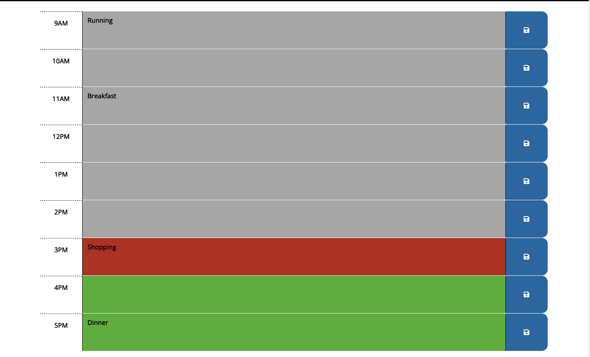
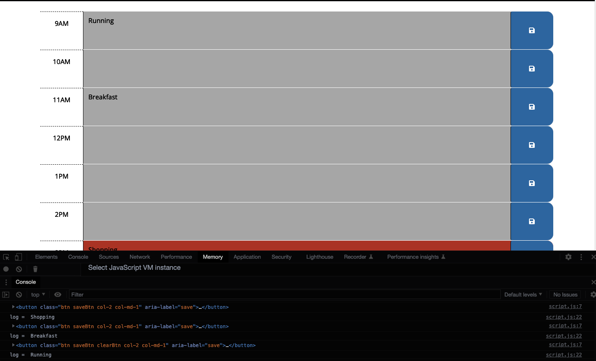
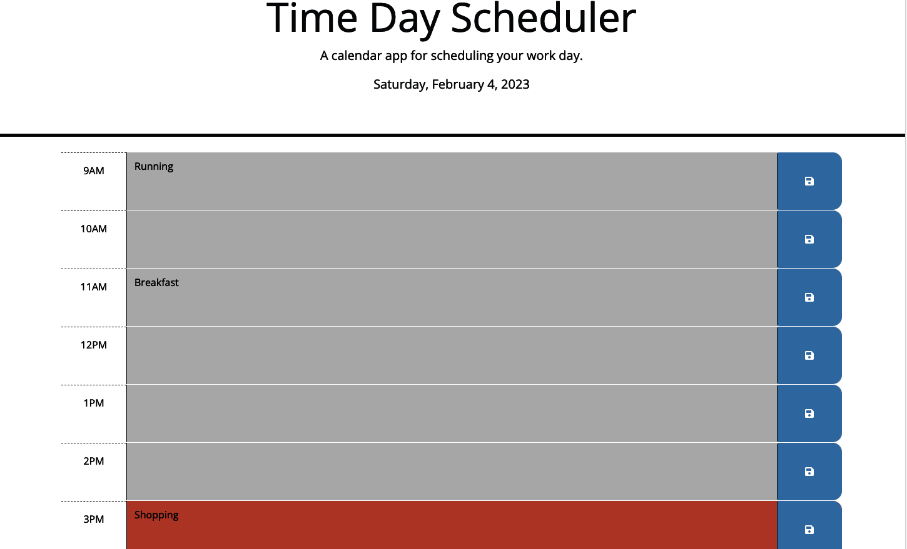

<h1 align="center">Time Scheduler Organizer</h1>

This project is tailored to help users to manage their day.

                                                   ScreenShots 🏆

## Table of Contents

  [Installation](#installation)

  [Usage](#usage)

  [License](#license)

  [Contributing](#contributing)

  [Tests](#tests)

  [Questions](#questions)

[Deployment Website](https://jonjon50.github.io/Time-Scheduler-Organizer/)

<h1 align="center">Hi 👋, I'm John Hagens</h1>
<h3 align="center">Frontend Developer at UCF Bootcamp</h3>

## Description

- 🔭 I’m currently working on [Time Scheduler Organizer](https://github.com/JonJon50/Portfolio-Project)

- 🌱 I’m currently learning **HTML, CSS, Javascript, Jquery, Bootstrap**

- 👯 I’m looking to collaborate on [New Project with](UCF)

- 🤝 I’m looking for help with [future project including this one.](https://jonjon50.github.io/Time-Scheduler-Organizer/)

- 👨‍💻 All of my projects are available at [https://github.com/JonJon50?tab=repositories](https://github.com/JonJon50?tab=repositories)

- 📫 How to reach me **ginuwine104@gmail.com**

<h3 align="left">Connect with me:</h3>

 ## Installation

<h3 align="left">Languages and Tools:</h3>

               

- [Profile](https://github.com/JonJon50 "_John Hagens_")
- [Email](gginuwine104@gmail.com "Hi!")
- [Linkedln](https://www.linkedin.com/in/john-hagens-55b15212a/ "Welcome")

- JavaScript
- Jquery
- Bootstrap
- HTML
- CSS

- [x] Reliable Storage // This is done local storage
- [x] Authentication // This is done

Contributions, issues, and feature requests are welcome!
Give a ⭐️ if you like this project!

## License

  MIT License

